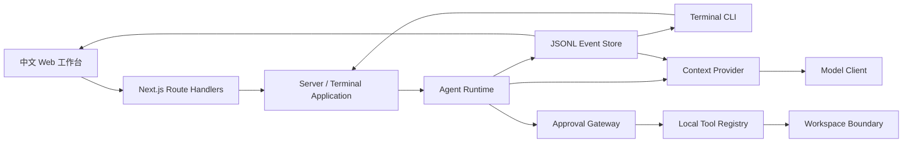

# SEcode

SEcode 是一个面向可信本地单用户的编程智能体。它使用 Next.js 提供中文 Web 工作台，同时提供可交互 Terminal 入口；模型工具循环、上下文管理、审批、工作区隔离和 JSONL 事件存储均由项目自行实现，不依赖 Agent 框架或托管代码执行服务。

公开仓库：[github.com/StarKirbyyy/SEcode](https://github.com/StarKirbyyy/SEcode)

## 核心能力

- 原生 OpenAI-compatible Chat Completions 流协议，支持 DeepSeek、LongCat 和 Generic profile。
- 六个本地工具：`list_directory`、`read_file`、`search_text`、`write_file`、`replace_in_file`、`run_process`。
- 普通模式直接执行；Plan Mode 先只读规划，用户批准计划后在同一 run 中继续。
- 危险工具审批、任务取消、模型与工具预算、总时限、重复错误和无进展保护。
- 版本化中文 System Prompt、可见输出中文合规门、模型 usage 与供应商 Prompt Cache 统计。
- 完整回合上下文投影、长历史压缩、确定性降级摘要和进程内 Context Cache。
- JSONL 事件作为 Session 的可审计事实源，支持刷新、服务重启后的恢复和安全删除。
- Web transcript 展示模型正文、工具参数与结果、审批、错误、终态和已验证的本地服务链接。

## 架构概览



纯文本调用链：`Browser / Terminal → Application → Agent Runtime → Context / Model → Approval / Tools / Workspace → JSONL Event Store`。

主要模块：

| 模块 | 职责 |
| --- | --- |
| [`lib/agent`](lib/agent) | Agent 状态机、计划门禁、预算、取消、完成收敛和失败恢复 |
| [`lib/context`](lib/context) | System Prompt、历史投影、上下文压缩、摘要和语言策略 |
| [`lib/model`](lib/model) | 模型配置、原生 `fetch`、SSE 解析、重试和 provider 归一化 |
| [`lib/tools`](lib/tools) | 六工具、参数 Schema、输出限制、原子写和进程生命周期 |
| [`lib/workspace`](lib/workspace) | 工作区身份、路径解析、符号链接和写前重验 |
| [`lib/approval`](lib/approval) | 风险评估、一次性授权能力和进程策略 |
| [`lib/storage`](lib/storage) | JSONL Session、事件追加、恢复、分页和删除安全 |
| [`lib/server`](lib/server) | 本机 API、NDJSON 流和受限工作区选择器 |
| [`lib/client`](lib/client) | 客户端事件投影、历史协调、transcript 和打字效果 |

## 安全边界

SEcode 的文件和进程能力位于服务端，浏览器不会获得 API Key 或任意本机路径访问能力。核心约束由确定性代码执行，而不只依赖模型遵守 Prompt：

- Session 固定绑定一个 canonical workspace 和模型 profile。
- 工具只接受工作区相对路径；拒绝绝对目标路径、`..` 穿越和符号链接逃逸。
- 写入前重新校验真实父目录和文件身份，使用同目录临时文件与原子替换。
- `run_process` 使用 `spawn(program, args)`，默认不开 shell，不把参数拼接成命令字符串。
- 未知程序、shell、依赖安装、删除和 Git 写操作依风险策略审批或拒绝。
- Plan Mode 同时通过工具定义过滤和 Runtime 检查保持只读。
- API 只接受本机 Host；修改请求检查同源 Origin，响应不开放 CORS。
- 凭据只从服务端环境读取，事件、错误和公开工具参数经过限制与脱敏。

本项目面向可信本地单用户，不是用于隔离恶意代码的操作系统级安全沙箱。不要把不可信仓库、命令或模型输出视为已被强隔离。

## 环境要求

- Node.js `>=20.9.0`
- pnpm `10.33.3`
- Next.js `16.3.3`
- React / React DOM `19.2.8`
- Web E2E 使用本机 Google Chrome

## 快速开始：Web 工作台

1. 安装依赖：

   ```bash
   pnpm install --frozen-lockfile
   ```

2. 创建仅供本机使用的配置：

   ```bash
   cp .env.example .env.local
   ```

3. 编辑 `.env.local`：至少配置一个可用模型，并把 `SECODE_WORKSPACE_PICKER_ROOT` 设置为包含可选项目的绝对目录。不要提交该文件。

   使用默认 DeepSeek profile 时，最少需要：

   ```dotenv
   DEEPSEEK_API_KEY=<your-api-key>
   SECODE_WORKSPACE_PICKER_ROOT=/absolute/path/to/projects
   ```

4. 启动开发服务器：

   ```bash
   pnpm dev
   ```

5. 打开 [http://localhost:3000](http://localhost:3000)，选择受限根目录内的工作区并创建任务。

默认 Session 数据写入仓库下被忽略的 `.secode-data`。可以通过 `SECODE_DATA_DIR` 改为其他位置。

## 模型配置

Next.js 会读取 `.env.local`。Terminal 不会自动加载 `.env` 文件，使用 Terminal 时必须在当前进程环境中显式导出相同变量。

| Profile | 配置 |
| --- | --- |
| `deepseek` | `DEEPSEEK_API_KEY` 必需；`DEEPSEEK_BASE_URL`、`DEEPSEEK_MODEL`、`DEEPSEEK_CONTEXT_WINDOW` 有示例默认值 |
| `longcat` | 设置 `LONGCAT_BASE_URL` 和 `LONGCAT_MODEL` 后注册；可选 `LONGCAT_API_KEY`、`LONGCAT_CONTEXT_WINDOW`、`LONGCAT_SUPPORTS_THINKING` |
| `generic` | 设置 `OPENAI_COMPAT_BASE_URL` 和 `OPENAI_COMPAT_MODEL` 后注册；可选 `OPENAI_COMPAT_API_KEY`、`OPENAI_COMPAT_CONTEXT_WINDOW`、`OPENAI_COMPAT_SUPPORTS_THINKING` |

非本机模型 endpoint 必须使用 HTTPS；HTTP 只允许 loopback 地址。完整变量清单和无秘密示例见 [`.env.example`](.env.example)。

## Terminal 使用

先把模型凭据和配置导出到当前 shell，然后查看帮助：

```bash
export DEEPSEEK_API_KEY=<your-api-key>
pnpm agent -- --help
```

创建绑定工作区和模型的 Session：

```bash
pnpm agent -- --workspace /absolute/path/to/project --model deepseek
```

指定独立数据目录：

```bash
pnpm agent -- --workspace /absolute/path/to/project --model deepseek \
  --data-dir /absolute/path/to/data
```

恢复已有 Session 时使用创建它的同一数据目录：

```bash
pnpm agent -- --session <session-uuid> --data-dir /absolute/path/to/data
```

交互命令：

| 命令 | 作用 |
| --- | --- |
| `/help`、`/status` | 查看帮助或当前运行状态 |
| `/plan on\|off` | 设置下一任务是否先规划后执行 |
| `/approve-plan`、`/reject-plan` | 批准或拒绝当前计划 |
| `/approve`、`/reject` | 批准或拒绝待审批工具操作 |
| `/cancel` | 取消当前 run |
| `/exit` | 安全退出 Terminal |

## Session、事件与恢复

- 每个 Session 固定绑定工作区与模型 profile；更换工作区应创建新 Session。
- `events.jsonl` 是运行状态、工具事实、审批和 assistant 可见输出的唯一持久化事实源。
- Web 刷新或服务重启后，服务端和客户端从 durable events 重建 Session 状态；不会重放历史打字动画或重复执行工具。
- 上下文压缩只影响后续模型输入，不删除或改写原始 JSONL 事件。
- 删除 Session 只清理经过 UUID、真实路径和标记校验的 Session 数据目录，不删除绑定工作区。
- `run.completed` 表示 Agent 已正常交付最终回答，不保证所有业务目标自动验收通过；验证或服务启动不完整时，最终回答会保留明确警告。

## 验证

常用质量命令：

```bash
pnpm lint
pnpm typecheck
pnpm test
pnpm test:coverage
pnpm test:e2e
pnpm build
```

截至 2026-08-31，阶段 26 Summary 记录的完整门禁为：

- lint 和 TypeScript 类型检查通过；
- 120 个 unit/integration 测试文件，1034/1034 项通过；
- V8 coverage：statements 88.56%、branches 82.55%、functions 91.42%、lines 90.40%；
- 51/51 项 Playwright E2E 通过；
- 默认与独立 `distDir` 的两次 production build 通过；
- `git diff --check` 和隔离环境 agent-browser 验收通过。

本次 README 观察另行现场重跑了 lint、typecheck、1034 项 coverage 测试和 `git diff --check`；E2E、双 build 与 agent-browser 数字来自已批准的 [阶段 26 Summary](docs/development/26-agent-convergence-efficiency-summary.md)，没有在 README 文档阶段重复执行。

## 已知限制

- 仅面向本机可信单用户，没有认证、多租户或远程工作区能力。
- 不是恶意代码安全沙箱；工作区隔离和审批不能替代容器或虚拟机。
- 模型接入范围是 OpenAI-compatible Chat Completions 流协议，不等于兼容任意 provider 私有协议。
- 工具调用按顺序串行执行；当前没有并行工具执行或多 Agent 编排。
- LongCat 和 Generic profile 有协议、单元及集成覆盖，但阶段 26 修订 2 的可选真实 provider 回归 T26R2-08 尚未执行；不能据此宣称所有 provider 的最新策略均已真实通过。
- Agent 不自动 commit、push、发布或部署。相关命令仍受工作区、进程策略和用户授权约束。
- 成功交付的本地 service 可保持运行；失败、取消和超时路径会清理对应进程树。SEcode 当前不提供独立的长期服务管理界面。

## 开发文档

- [阶段开发与三级审批规范](docs/development/00-process.md)
- [需求、范围与验收标准](docs/development/01-requirements.md)
- [开发阶段索引](docs/development/README.md)
- [阶段 26 收敛效率 Spec](docs/development/26-agent-convergence-efficiency-spec.md)
- [阶段 26 实施 Summary](docs/development/26-agent-convergence-efficiency-summary.md)

SEcode 的开发历史保留了各阶段的 Spec、Task、Summary、失败记录和人工门禁。历史失败不会因后续修复而被追溯改写为成功。
